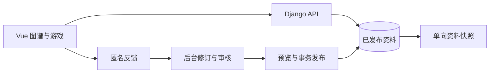

# 干员关系档案

以原文证据为基础的明日方舟人物关系图谱，提供人物搜索、关系与出处查阅、人物连线游戏，以及资料修订、审核和发布后台。这个仓库面向开发者，包含应用源码、初始化资料、固定版本素材和验证工具。

**在线体验：[arklinks.top](https://arklinks.top) · [人物连线游戏](https://arklinks.top/game/)**

## 快速开始

使用 Git、Python 3.12、uv、Node 24、npm 和 GNU Make，推荐 Linux 或 WSL。依赖由 `backend/uv.lock` 和 `frontend/package-lock.json` 固定。

```bash
git clone https://github.com/CELLOPOI/arknights-relationship-atlas.git
cd arknights-relationship-atlas
make install
make check
```

构建所需的固定版本素材随仓库提供，无需另行索取或导入资源包。`make check` 执行隔离 SQLite 后端检查、前端类型检查与完整构建、游戏和图谱测试及工具检查。

首次启动本地应用时，按[本地开发指南](docs/DEVELOPMENT.md#启动可丢弃的开发环境)创建 SQLite 开发库、应用初始资料版本并启动 API；另开终端执行 `npm --prefix frontend run dev`，访问 `http://127.0.0.1:5173/`。前端运行需要 API，单独启动 Vite 不会加载正式资料。开发与测试使用独立数据库。

## 功能与资料边界

图谱从国家与阵营进入，支持人物搜索、跨阵营展开、分组浏览和原文查阅。游戏复用人物与关系资料，提供普通补全、六步探索、输入挑战和双人判断四种模式，并支持立绘与本地进度恢复。游客可提交匿名反馈，后台将反馈转成修订，经过审核、差异预览和事务发布后更新公开资料。

仓库初始化基线包含 **565 位人物、5,711 条关系**，并非全游戏人物全集；应用中的资料可继续经后台修订。

- 保留稳定人物 ID、关系方向、异格身份、证据和条件叙事。同阵营、同场景或游戏中的双向通路不自动代表相识。
- 数据库的已发布版本是应用资料依据。Git 保存初始化基线和单向快照，修改基线不会自动覆盖已维护的数据。
- 反馈、联系方式、账号和内部处理记录属于私有数据，不进入公开快照或仓库。
- API 失败时页面显示错误和重试，避免用旧 JSON 代替当前资料。旧账号社区默认关闭。

详见[资料规范](docs/DATA_SOURCE.md)、[后台工作流](docs/EDITORIAL_WORKFLOW.md)、[图谱分组](docs/RELATION_GROUPS.md)与[游戏实现](docs/GAME.md)。

## 架构与目录

前端使用 Vue 3、TypeScript 和 Vite，图谱与粒子交互使用原生 SVG、Canvas/WebGL。后端使用 Django、Django REST Framework 和 Django Admin，提供查询、反馈与受控资料发布。SQLite 支持快速本地开发；PostgreSQL 用于验证行锁、并发和数据库约束。



| 目录 | 内容 |
| --- | --- |
| `frontend/` | 页面、图谱、游戏、前端测试及依赖锁文件 |
| `backend/` | API、模型、后台、迁移、发布服务及测试 |
| `data/source/`、`data/npc/` | 初始化基线、来源记录及资料归档 |
| `assets/` | 固定版本素材、来源清单和校验器 |
| `scripts/` | 资料处理、资源工具和浏览器验证 |
| `compose.yaml`、`deploy/Caddyfile`、各应用 `Dockerfile` | 通用容器构建和服务契约 |
| `docs/`、`.agents/notes/` | 开发与数据文档、工程决定和验证记录 |

## 验证与贡献

日常运行 `make check`；修改后端、模型或资料发布逻辑时，还需使用专用测试库运行 `make check-postgres`。SQLite 通过不能代替 PostgreSQL 的锁、并发和约束验证。浏览器回归按交互改动选择，命令和环境见[开发指南](docs/DEVELOPMENT.md)与[工具索引](scripts/README.md)。

通过 [Issues](https://github.com/CELLOPOI/arknights-relationship-atlas/issues)讨论问题，从短期分支提交 PR，并说明行为变化和实际验证。资料纠错请提供人物或关系、建议修订和可定位的原文出处。开始前阅读[贡献指南](CONTRIBUTING.md)及[仓库文件约定](docs/REPOSITORY_POLICY.md)。

进一步了解：[文档索引](docs/README.md)、[当前实现](docs/CURRENT_IMPLEMENTATION.md)、[素材说明](docs/RESOURCE_PACK.md)、[工程决定](.agents/notes/)。

## 来源与许可

本项目是非官方资料工具，与游戏官方无隶属关系。原创代码采用 [MIT](LICENSE)。游戏美术、商标、剧情原文、字体及第三方依赖保留各自权利和来源；素材随仓库提供不改变其权利状态，代码许可证不包含这些内容的再分发授权。详见[第三方声明](THIRD_PARTY.md)和[素材与字体记录](docs/ASSET_LICENSING.md)。
