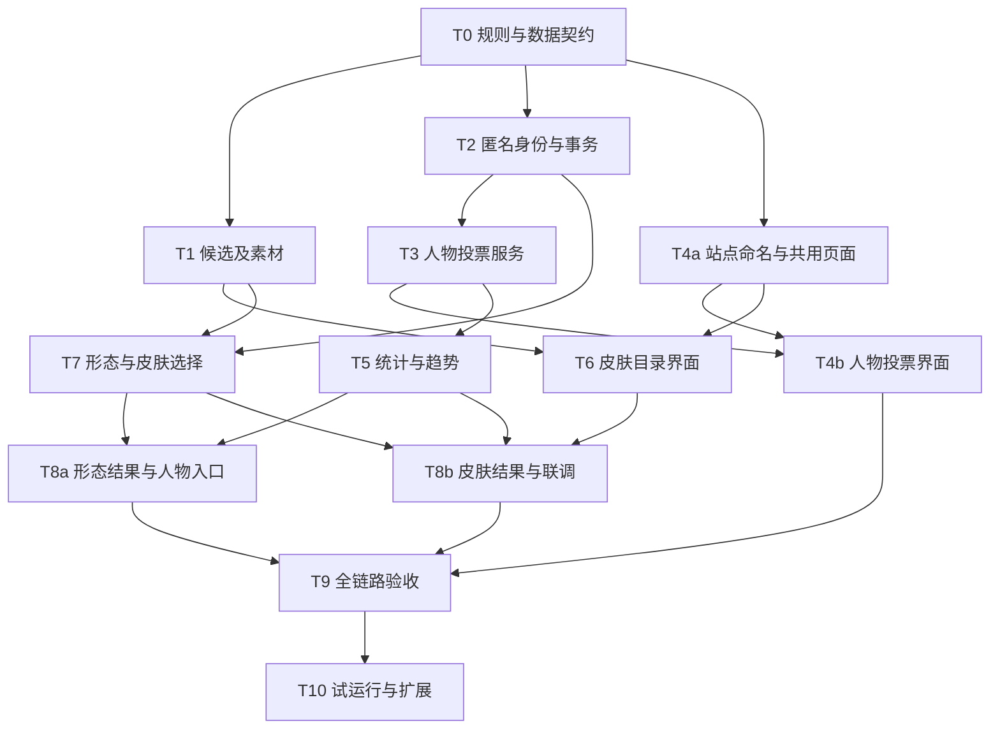

# 「喜好」功能开发计划

Status: implemented (T0–T9 与 V2；T10 待公开试运行)
Date: 2026-09-23

V2 已扩展为全形态目录、半身灰阶卡面、逐剧情 NPC、双上限加权与综合榜、50 次休息和双向切页。现行参数及证据见[统计说明](PREFERENCES_STATISTICS.md)和[V2 验收](PREFERENCES_V2_ACCEPTANCE.md)。下列首版任务描述保留设计沿革；旧的小批数量不再限定当前范围。

本计划承接[策划案](POPULARITY_PROPOSAL.md)与[开发需求](POPULARITY_REQUIREMENTS.md)，首版 T0–T9 已实现并完成本地验收；当前范围与结果见[运行说明](PREFERENCES.md)。下文保留任务分解与依赖，T10 公开试运行另行执行。范围包括更名为「方舟关系与喜好」、统一浏览器标题、调整「人物关系 / 游戏 / 喜好」导航，以及喜好同页左侧「人物 / 皮肤」切换。策划案持有产品参数，需求文档持有 R / A 编号及验收条件，本文只维护任务、依赖、产物与检查顺序。先完成完整路径的小批交付，再扩展候选与素材覆盖。

## 1. 开发基础与范围

当前可以复用的内容包括匿名反馈的安全处理模式、受控资料发布、人物稳定 ID 和别名、游戏双人物构图、基础/精二立绘加载以及现有页面转场。不能直接复用的部分是正式投票身份、并发额度、偏好名录、服饰完整素材和统计模型，它们现已在 preference 业务模块独立实现。

前端另有用户明确指定的本地 `arknights-rebuild` 参考工程。T0 与 T4a 开始时先阅读其 README、源码说明及参考学习文档，重点核对 `src/chunks/layout/modules/Layout.js`、`src/chunks/homepage/modules/Sections.js`、`SectionCharClient.js`、`SectionMediaClient.js` 和 `src/styles/`。桌面/手机截图可作辅助证据，具体学习范围见[参考资料](SOURCE_LEARNING.md)。T4 的页面外壳与人物比较、T6 的皮肤网格应体现一致的字体、间距、导航与反馈；具体业务构图遵循本项目已确认需求。参考目录保持只读，不整包迁入其运行时，也不将其变成正常构建的前置依赖。

| 现有位置 | 后续工作 |
| --- | --- |
| [frontend/src/main.ts](../frontend/src/main.ts) | 增加统一 /preferences/ 入口，响应同路径 tab/form 参数与浏览历史；沿用当前机制 |
| [AtlasShell.vue](../frontend/src/components/AtlasShell.vue)、[GameApp.vue](../frontend/src/game/GameApp.vue) | 更新站名与功能导航，借鉴双立绘布局；保持图谱和游戏回归 |
| [CharacterIllustration.vue](../frontend/src/game/CharacterIllustration.vue)、[illustrations.ts](../frontend/src/game/illustrations.ts) | 复用安全加载及必要显示能力，隔离游戏换图状态 |
| [appearance-catalog.json](../frontend/src/game/appearance-catalog.json)、[appearances.ts](../frontend/src/game/appearances.ts) | 核对人物与形态映射，扩展职业补丁时防止误合并 |
| [backend/config/urls.py](../backend/config/urls.py)、backend/atlas/ | 新增偏好 API、模型、事务服务、管理入口和聚合命令 |
| [feedback_views.py](../backend/atlas/feedback_views.py)、[throttles.py](../backend/atlas/throttles.py) | 参考 CSRF、风险与限速模式，不把反馈 IP 限额当作独立真人身份 |
| [素材清单](../assets/resource-manifest.json)、[立绘来源](../assets/illustration-manifest.json) | 新素材生成与验证，按固定版本纳入构建 |
| [现有立绘准备脚本](../scripts/prepare-game-illustrations.mjs)、[异格准备脚本](../scripts/prepare-game-appearances.mjs) | 复用来源校验和转换流程，补充服饰及职业图标专用准备工具 |

建议前端新增 preferences 业务目录，以一个页面外壳持有左侧切换和个人状态，人物、皮肤作为其内容组件；后端在现有 atlas 应用下按 preference/popularity 职责拆文件。API 前缀与页面展示名称不必相同。首版沿用现有数据库与工具链，不为此单独引入微服务、队列系统或新的全站路由框架。

规则参数由服务端统一配置并返回，记录参数版本；前端只展示。下列分组需要明确对应配置项：正式任务额度与期限、配对策略与重复约束、支持/本命槽位、修改冷却、统计窗口与样本门槛、聚合频率、风险与事件保留期。具体值只从策划案维护，实施文档避免复制出多个冲突默认值。

## 2. 素材准备清单

以下保留 2026-09-23 的准备依据。现已导入的固定清单、446 个完整形态及视觉核验范围以[素材说明](PREFERENCES_ASSETS.md)为准。

### 八职业图标

已验证 [Aceship/Arknight-Images 的固定提交](https://github.com/Aceship/Arknight-Images/tree/0b28f9562fcadbd644c6225f8f8aefbb500b4d22/classes) 包含下列文件。当前独立 preferences 素材包已包含这些图标，并完成尺寸、透明通道和深色界面检查。

| 数据职业值 | 中文 | 上游路径 |
| --- | --- | --- |
| PIONEER | 先锋 | classes/class_vanguard.png |
| WARRIOR | 近卫 | classes/class_guard.png |
| TANK | 重装 | classes/class_defender.png |
| SNIPER | 狙击 | classes/class_sniper.png |
| CASTER | 术师 | classes/class_caster.png |
| MEDIC | 医疗 | classes/class_medic.png |
| SUPPORT | 辅助 | classes/class_supporter.png |
| SPECIAL | 特种 | classes/class_specialist.png |

“全部”使用文字或普通界面符号，不伪称游戏职业。八职业图标仅出现在筛选控制中，干员卡片仍只放立绘和名字。

### 精一、精二与命名服饰

优先复用固定素材包的基础、精二图。新增服饰沿用 [fexli/ArknightsResource 固定提交](https://github.com/fexli/ArknightsResource/tree/3596def3267fe2b172ba20895b47e11c0523642f/charpack) 的 charpack 来源；具体来源已记录于立绘清单。例如[斯卡蒂「驭浪 WR04」](https://github.com/fexli/ArknightsResource/blob/3596def3267fe2b172ba20895b47e11c0523642f/charpack/char_263_skadi_summer_3.png)与[浊心斯卡蒂「升华」](https://github.com/fexli/ArknightsResource/blob/3596def3267fe2b172ba20895b47e11c0523642f/charpack/char_1012_skadi2_boc_4.png)有明确路径。

本地 517 条有名称服饰记录的 illustId，在去除前缀并正规化文件名后，都能匹配到固定 Git 树中的 PNG/bPNG。该结果只证明路径存在，仍须逐项核验合格实装范围、皮肤归属和图像内容；不能据此宣称 517 套已上线可投或全量无缺失。

准备流程：

1. 读取 skin_table、character_table、char_patch_table 与必要的形态归组元数据，保存输入版本或内容摘要。生成审读清单，不写线上正式人物资料。
2. 建立人物、具体形态、职业、外观稳定映射；按常规 buildinEvolveMap 与补丁 buildinPatchMap 判定真实基础阶段。阿米娅近卫、医疗来源为 patchChars，需补现有网站未收录的图与映射。
3. 清理测试/重复/未确认实装记录，合并同一外观的动态与静态资源。同名不必然同皮肤，相同文件也不必然同人物，去重须留依据。
4. 下载固定提交、校验 blob/内容摘要、解码检查。对有 PNG/bPNG 两种文件者核对实际含义和构图，不能机械取其一就称验证完成。
5. 生成完整立绘与卡面缩略图，记录尺寸、透明裁边、焦点位置和生成参数；缩略图用于列表，全幅图用于正式选择。用实际渲染检查面部、背景、特效边缘与超宽构图。
6. 输出素材清单和缺口报告，按完整形态目录发布。只完成一位干员的部分服饰时，该形态仍不开放正式票。
7. 按现有素材版本流程交付，核实干净克隆可构建。保留来源与既有权利状态，不把第三方图片标成项目原创或已完成许可核实。

首批可用约 30 个完整形态验证流程，但必须覆盖需求文档末尾的边界类别和八职业，不能只挑几位热门六星。网格可以展示更广的已知干员目录，未完整者在详情说明“目录整理中”；页面显示实际已开放范围。职业补丁若当批无足够资源，应明确暂未开放，不能用错误图片填齐测试。

## 3. 任务与依赖

以下依赖允许素材核查与服务端基础并行。皮肤是本次完整交付的一部分，T6–T8 不能以占位入口代替。

T3 可先用合成候选开发，真实入口开放前必须完成 T1 对应人物名单；T6 可先用覆盖边界的本地样例开发，不把样例结果暴露为公共投票。以上是开发并行关系，不能据此跳过发布前的数据核验。

### T0：冻结首版契约

对应 R-01、R-14–R-17。整理参数配置、三层 ID、状态枚举、名录兼容规则和 API 请求/响应。明确支持、无明显偏好、撤回、未确认新名录、风险暂缓是不同状态。

固定已定站名、默认浏览器标题和「喜好 → 人物 / 皮肤」层级，落实共用外壳、查询参数、视图切换与状态保留契约；核对页面挂载与导航。确定职业筛选顺序、干员稳定排序依据及用户默认卡面规则。新增资料类型的名录发布须明确审核、预览、原子生效及回退责任，不依赖关闭正式资料保护开关。

产物为接口契约、最小模型草图、迁移顺序与合成用例清单。完成条件是前后端能够独立实现同一份状态转换；不要求重新让用户确认已经明确的布局与长期观察方向。

### T1：准备人物候选与素材目录

对应 R-06–R-10、R-14。精选 NPC 名单有身份、立绘和入选理由，人物随机池采用统一代表图。同步按第 2 节准备皮肤元数据、八职业图标、全幅和卡面素材，建立未完备原因。

产物为可审核的名录差异、固定素材清单、覆盖报告和用于实现的代表样例。检查归属、重复 ID、悬空引用、阶段例外、职业枚举、图片解码与缩略图构图。人物名单和皮肤目录可以分别达到就绪状态，均须经过对应发布检查。

### T2：匿名身份、事务和开关

对应 R-02、R-15–R-17。建立匿名凭证、个人状态版本、幂等处理、写入开关、CSRF 与分接口限速。迁移新增投票业务表，正式人物和关系资料维持既有发布边界。

同时实现投票候选与外观名录的后台审核、差异预览、版本原子发布和回退服务。发布时校验 T1 的归属、完整性与已部署素材；投票写入在事务中核对有效名录，处理发布与派发/提交并发、旧版本拒绝、待答题失效与预留次数返还。回退生成新名录版本，不删除已经存在的投票历史。服务可以先用合成目录开发，真实入口开放必须同时满足 T1 的对应完整资料和本服务验收。

产物为持久身份与事务服务、隔离的公开/私有读取，以及管理暂停能力。使用 PostgreSQL 合成并发验证重复请求、唯一约束、版本冲突和多标签一致性；证明 Cookie 丢失时只按已知身份处理，不声称识别同一真人。

### T3：人物投票服务

对应 R-03–R-06。实现原子出题、额度和重复约束、任务续签/过期/作废、正式选择与跳过、厨力整名单替换和本命子集。练习与正式处理路径隔离。

先建立可回放原始事件和基础数量核对。完成条件包括跨周与滚动窗口边界、人物/对位额度、一次成功消费、跳过无胜负、撤旧加新一致。服务器时间和时区配置必须可在测试中控制。

### T4：站点命名、共用页面与人物投票

对应 R-01–R-05、R-17。T4a 承接站点命名与共用页面，在 T0 契约确定后可先行；T4b 承接人物界面与真实投票服务联调，依赖 T3 和 T4a。同步站点显示名、默认浏览器标题、首页文字、导航品牌与现有分享元数据；统一功能导航为「人物关系 / 游戏 / 喜好」。检索现有名称在静态 HTML 与运行时标题中的位置，区分站点品牌、历史说明和内部工程标识，避免机械全局替换。

建立统一喜好页面和左侧「人物 / 皮肤」切换，处理同路径查询参数、刷新/历史恢复、每视图草稿与滚动状态；先完成可供 T6 接入的共用外壳。参考游戏双人物布局完成随机选择，整合搜索厨力、名单编辑、个人记录和结果入口。展示真实服务器额度、失败重试、待确认与停用状态。切离人物期间停止自动出下一题，正在提交的结果仍按原对象更新。

只复用展示能力；必要时抽出立绘显示组件并回归游戏的精一/精二切换。完成桌面、手机同屏选择、明确跳过、键盘操作、刷新恢复与导航退出，以及 A-16–A-18 中本批可验证的部分。公共入口不展示演示排名。T6 可在共用外壳契约完成后并行开发，无需等待 T4 所有人物界面细节。

### T5：统计、快照与趋势

对应 R-12、R-13、R-15、R-17。实现支持当前状态聚合、随机模型、样本状态、直接对位结果和每日快照。聚合命令有输入截止点、版本、失败状态、重复运行保护与修订关联。

在合成数据上检查已知偏好方向、均衡随机、循环偏好、全胜/全败、断图、高跳过和贡献不均。对相同输入重跑可得到可解释一致结果；重采样随机种子或运行标识可追踪。对每标识贡献限制进行敏感性对照，不为了预期名次调参。

支持快照可先形成可用结果，随机榜不足门槛时按“样本积累中”交付。合成数据验证模型行为，不能充当本站真实流量或全体玩家代表性证据。

### T6：皮肤干员网格与选择详情

对应 R-01、R-07–R-10。将皮肤内容接入 T4 共用页面的左侧「皮肤」切换，不另挂顶层页面。先完成用户明确指定的布局：按职业的竖幅卡片、仅立绘和名字、默认基础图、右侧职业大按钮、搜索、滚动恢复。再接完整候选、全幅预览、三位临时比较与确认。

桌面和手机先以真实素材覆盖布局边界。验证左侧切换与右侧职业控制同时存在时的内容宽度、长名、八职业、阿米娅职业补丁、基础阶段缺失、超宽图及皮肤背景不同的情况；手机职业按钮靠主体工具区右侧，不占整列。加载列表时仅请求视口所需缩略图，详情才取对应大图；图片和个人状态晚到不能导致误选或错认。

完成条件是 A-01、A-04、A-05、A-13 的交互部分通过，且所有视觉样例清楚标为本地开发数据。

### T7：形态、皮肤选择与个人卡面状态

对应 R-06、R-09–R-11、R-14–R-16。实现每对象当前选择、冷却、撤回、名录确认、乐观版本检查与风险状态，接入 T6 卡面恢复。形态偏好复用适当的版本规则，不能共用同一票池。形态部分同时实现人物档案中的候选选择、无明显偏好、冷却及重新确认界面，可以先于皮肤网格单独交付。

专门测试服务器受理成功但响应丢失、跨标签改选、同操作重复、撤回再登记、冷却期间确认原选择、新皮肤发布以及旧项撤下。默认图不计票；预览不变卡面；新名录未确认不删除个人旧图；公共结果不控制个人卡面。

完成条件为 A-02、A-03、A-06、A-07 通过，并可从持久当前状态恢复全部已选择卡面。

### T8：皮肤结果、形态结果与整页联调

对应 R-06、R-10–R-13。接入当前名录的明确选择分布、无明显偏好、样本状态、历史版本和更新时间。服饰过滤保持正确分母，新增皮肤处标注统计节点。

T8a 为形态结果与人物入口联调，依赖 T5、T7 的形态部分，不依赖 T6 皮肤网格；完成后随第二批交付。T8b 为皮肤结果与目录联调，依赖 T5、T6、T7 的皮肤部分，随第三批交付。

联调左侧人物/皮肤切换 → 干员目录 → 详情 → 确认 → 返回换卡面 → 刷新恢复 → 查看结果；再从人物档案和带 tab/form 参数的直接链接进入。验证切换、浏览器历史与提交中离开不会额外派发任务、丢失草稿或把响应写到错误视图。名录未完整、汇总滞后和资源故障均有可恢复状态。完成 A-11、A-14、A-16–A-18，确认没有把皮肤结果混入人物总榜。

### T9：整体验收与可发布检查

执行需求文档全部 A 场景。所有写入使用可丢弃环境和合成记录；完成适用的 `make check`、`make check-postgres`、素材校验和浏览器验证。模拟接口用于界面失败场景，真实隔离 PostgreSQL 用于事务和端到端入库，报告分别标明。

演练暂停写入、缓存丢失、聚合失败、名录修复、异常排除与重算、数据清理、备份恢复。检查私有接口不会进入公共缓存；原始身份和风险日志不出现在快照或前端构建包。

从干净输入构建，验证图谱、游戏、站点说明、来源页及新增直链；确认默认关闭的旧社区接口没有被重开。同步当前实现、开发指南、素材记录及必要决策笔记，届时才将已实现范围从 proposed 更新为实际状态。

### T10：公开试运行与覆盖扩展

全部正式开放入口必须满足对应验收，再进入至少两周的试运行。明确试运行状态、真实采样日期和已开放的皮肤目录范围。新增目录逐批发布，固定统计版本，不按活动周期清票。

观察：有效参与广度、完成/跳过率、明确不熟悉反馈、候选曝光分布、名单登记率、皮肤确认率、异常复核量、图片失败率、聚合耗时与结果稳定性。查看按职业/形态的覆盖差异，不能只追求总票量。

真实流量不足时维持样本状态、扩大资料覆盖；规则调整留版本与理由。若匿名重复身份已明显影响结果，再评估更强验证或单独的可信样本视图，不直接给登录用户乘票权。

## 4. 交付批次与检查点

| 批次 | 交付内容 | 必须完成的任务与条件 |
| --- | --- | --- |
| 第一批：人物投票基础 | 站名与导航更新、共用喜好页面、匿名随机比较、厨力与本命、个人记录、基础公开结果 | T0、T2–T4、T1 的人物候选；T5 中基础聚合；重复提交和额度并发验证通过 |
| 第二批：统计与人物详情 | 随机榜、趋势、对位查看、形态偏好 | T5、T7 的形态服务与界面、T8a；样本不足与版本节点正确，不强制制造名次 |
| 第三批：同页皮肤视图 | 左侧人物/皮肤切换联调、职业平铺、精一/精二/服饰、个人卡面替换、结果与趋势 | T1 的首批完整皮肤素材、T6–T8；没有永久占位或部分目录假装完整 |
| 发布检查与试运行 | 当前范围验收、保护开关、修复与重算能力 | T9 对已开放批次的全部相关场景；T10 试运行不等于功能验收豁免 |

每批开放前都执行 T9 对本批适用的检查；最后一次覆盖整合范围。皮肤素材和前端可以在第一、二批期间并行准备，开发顺序不意味着皮肤无限延期。这里不预填工期天数：首批素材核验与统计实现完成后，根据实际剩余工作安排时间。

以下事项不作为本次交付依赖：旧账号系统恢复、登录加票、动态皮肤播放器、战斗特效/语音评价、公开评论、全人物矩阵和跨干员皮肤总榜。后续引入时需新口径，不迁移为已有立绘偏好的一部分。

## 5. 当前完成状态

历史首版 T0–T9 已完成：统一契约、402 个人物、436 形态、30 个完整皮肤目录、匿名持久身份、事务额度与幂等、独立名录审核发布、随机/支持/形态/皮肤界面、统计快照与风险纠正，以及本地验收。完整皮肤目录含 92 外观，27 个形态可投票、3 个单外观仅浏览。未完备目录没有开放投票。

验收包括 SQLite 与 PostgreSQL 全套检查、真实并发、固定素材、独立干净输入构建、离线统计校准、四视口模拟交互、真实浏览器/API 提交、原有入口回归和真实 PostgreSQL 备份恢复。具体计数、证据位置与限制集中维护于[运行说明](PREFERENCES.md)，不把自动化视口检查称为真实设备认证。

实际实现使用 `/api/preferences/`；全局发布保守作废旧待答并退额，形态确认独立按候选集合版本计算；宽构图缩略图保留完整人物，不用自动脸部裁切。理由见[首版决策](../.agents/notes/implemented/architecture/2026-09-23-preferences.md)。

T10 所需开关、名录发布、定点聚合、统计修订、风险复核与清理命令已具备。公开部署、外部调度告警、真实容量、至少两周有效流量观察和后续素材扩展未执行；本次不部署线上站点。

## 6. V2 完成状态

已完成446形态/1,361外观的元数据与图源交叉校验、全部半身联系表复核与异常修正、184NPC逐剧情选择和四单元缺项、双上限BT及参数模拟、70/30综合榜和版本趋势、50次休息、跨入口状态与双向滑动。通过现有资料修订演练补录64人物和50身份，喜好名录单独审核发布，旧状态与冷却保留。

实际全量覆盖、升级顺序、模拟结果和验证产物分别以 [素材说明](PREFERENCES_ASSETS.md)、[运行说明](PREFERENCES.md)、[统计说明](PREFERENCES_STATISTICS.md)、[V2 验收](PREFERENCES_V2_ACCEPTANCE.md)为准。T10 的公开部署、调度告警、容量、真实设备和至少两周公众试运行仍未执行。
